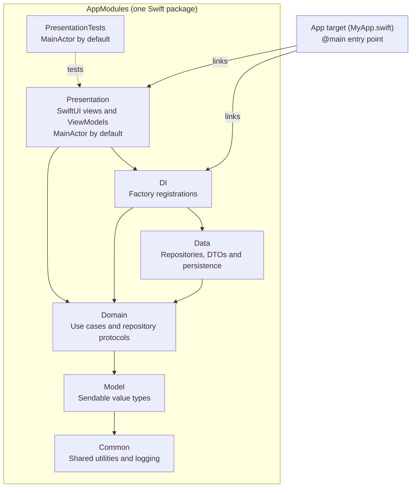

# MyApp

A SwiftUI app built on a strict, layered MVVM architecture. The app target is
intentionally minimal — **all logic and UI live in six separate Swift modules**
within one local package, `Packages/AppModules`.

> **Documentation:** [`docs/ARCHITECTURE.md`](docs/ARCHITECTURE.md) for the deep
> dive, [`AGENTS.md`](AGENTS.md) / [`CLAUDE.md`](CLAUDE.md) for AI-agent
> instructions. This README is the practical quick start.

## Using this template

This repo is a GitHub **template repository**. To start a new app from it:

**1. Create your repo from the template.** Click **“Use this template” → Create a
new repository** on GitHub (or `gh repo create my-app --template <owner>/<this-repo>`).
You get a fresh repo with this structure and clean history — no fork relationship.
Then clone it and `cd` in.

**2. Strip the example and name your project.**

```
make new-project NAME=AcmeApp
```

The template ships with a complete example feature (`Article`) so the patterns are
visible end to end. `new-project` removes that example from all six modules,
renames the app shell to `AcmeApp` (bundle id, `@main` struct, project name, paths),
and regenerates the Xcode project — leaving you a clean, compiling skeleton.
`NAME` must use letters and numbers, starting with a letter; reserved names and
underscores are rejected. Omit
`NAME=` if you only want to strip the example without renaming.

**3. Install the Xcode file templates.**

```
make install-templates
```

This adds the View/ViewModel and UseCase templates to Xcode’s **New File…** dialog
(under “MVVM Scaffold”), so you can generate scaffold-conforming code as you build.
Restart Xcode if it was open. See [`Templates/README.md`](Templates/README.md).

**4. Open and build.**

```
make open      # generates and opens AcmeApp.xcodeproj
make test      # run the package test suites
```

That’s the whole flow: **Use this template → `make new-project NAME=…` →
`make install-templates` → `make open`.** From here, add features layer by layer
(see *Adding a new feature* below) using the Xcode templates for the boilerplate.

> Prefer to keep the example feature while you learn the structure? Skip step 2,
> run `make setup` to generate the project, and explore the `Article` slice first.
> Run `make new-project` later when you’re ready to start clean. It refuses to delete uncommitted changes in example files, even though the Makefile skips the interactive prompt.

## Architecture



Main dependency paths are shown; shared `Model` and `Common` dependencies are
listed below. Both **Presentation** and **PresentationTests** use
`presentationSwiftSettings`, which includes `.defaultIsolation(MainActor.self)`
in [`Package.swift`](Packages/AppModules/Package.swift).

Each layer is a separate target/module in `Packages/AppModules/Package.swift`.
Target dependencies point downward only; consolidating the manifests preserves
module boundaries, imports, and per-target compiler settings.

```
Packages/AppModules/
├── Package.swift
├── Package.resolved
├── Sources/
│   ├── Common/
│   ├── Model/
│   ├── Domain/
│   ├── Data/
│   ├── DI/Registrations/
│   └── Presentation/Resources/
└── Tests/
    ├── DomainTests/
    ├── DataTests/
    └── PresentationTests/
```

The app consumes the Presentation and DI library products. Other layers remain
internal package targets, accessed through their declared target dependencies.
Declare external packages once in this manifest and add each product only to the
targets that need it. AppModules keeps its name when you rename the app.

### The modules

Source paths below are relative to `Packages/AppModules`.

- **Common** (`Sources/Common`) — shared utilities and native `Logger` categories. No internal dependencies.
- **Model** (`Sources/Model`) — domain entities as plain structs/enums. → Common.
- **Domain** (`Sources/Domain`) — business logic, use cases, and repository *protocols* (abstractions). → Model, Common. Pure Swift — does **not** depend on Factory, networking, persistence, or UI.
- **Data** (`Sources/Data`) — concrete implementations of Domain protocols, DTOs, mappers. → Domain, Model, Common. The only layer that knows about transport/persistence. Does **not** depend on Factory.
- **DI** (`Sources/DI`) — the **composition root**. The only production module that imports Factory for registration. It imports lower layers, binds Domain protocols to Data implementations, and exposes the `Container` keyPaths that ViewModels inject against. Registrations live under `Sources/DI/Registrations/`, one file per feature, so the wiring scales. → Common, Model, Domain, Data, FactoryKit.
- **Presentation** (`Sources/Presentation`) — `ViewState`, `@MainActor @Observable` ViewModels and SwiftUI Views. ViewModels inject Domain protocols via the keyPaths from DI. → Domain, Model, Common, DI. Never imports Data directly.

The dependency direction is always: View → ViewModel → Domain (protocol), with DI
binding Domain ← Data at the composition root. ViewModels and Views are fully
testable and previewable against mocks.

> The app links **Presentation** (for the root views) and **DI** (so the Factory
> registrations are compiled into the binary and available at resolution time).

### Why a separate DI module?

Putting registrations inside Data forced Presentation to link Data (a layering
leak) and made the `Container` keyPaths invisible where they were used. Isolating
composition in its own module means: Domain and Data stay free of any DI
framework, Presentation depends only on DI for the keyPaths (never on concrete
implementations), and all wiring lives in one navigable place that splits cleanly
into per-feature files as the app grows.

## Dependency injection — Factory (FactoryKit)

- Factory registrations live **only** in DI; Presentation uses Factory APIs through DI and depends on Data transitively. Presentation tests also depend on FactoryTesting. `import DI` brings in `Container`, `@Injected`, etc. (DI re-exports FactoryKit), so ViewModels import DI rather than FactoryKit directly.
- Registrations live in `Packages/AppModules/Sources/DI/Registrations/`, one file per feature (e.g. `ArticleRegistrations.swift`), binding protocol types to concrete implementations with the `self { }` sugar.
- ViewModels use `@ObservationIgnored @Injected(\.someUseCase)`.
- Previews swap in mocks with `Container.shared.x.preview { Mock() }`.
- Tests use the Swift Testing `@Suite(.container)` trait for isolated, parallel-safe runs and `.register { Mock() }` (via `FactoryTesting`).

## Local storage — SQLiteData

- On-device persistence uses [SQLiteData](https://github.com/pointfreeco/sqlite-data) (`.package(url: "https://github.com/pointfreeco/sqlite-data", from: "1.0.0")`), **not SwiftData**. It is a fast, lightweight layer over SQLite: queries stay explicit SQL, filtering/sorting/counting happen in the database rather than in memory, and nothing needs a live model container to be testable.
- Declare the dependency in `Packages/AppModules/Package.swift` and add its
  SQLiteData product to the **Data target only**. Domain still speaks in repository protocols over `Model` entities and knows nothing about SQLite; Presentation never sees it at all.
- `@Table` records are the persistence-side equivalent of a DTO — internal to Data, mapped to `Model` entities by a `toDomain()` mapper, with SQLite failures mapped into `DomainError`.
- The database and its migrations are created in Data and registered in DI as a `.singleton` Factory, so the app target stays `@main`-only.
- `@FetchAll` / `@FetchOne` are not used in Presentation: they would bind a view straight to the database and bypass Domain. Views render a ViewModel's `ViewState`; repositories query.
- CloudKit sync, if the app needs it, is SQLiteData's `SyncEngine`, configured alongside the database.

## Reference feature

A complete vertical slice ships as a reference, spanning all layers:

`Article` (Model) → `ArticleRepository` protocol + `FetchArticles` use case (Domain)
→ `SampleArticleRepository` + DTO/mapper (Data) → `ArticleRegistrations` (DI)
→ `ArticleListViewModel` + `ArticleListView` (Presentation).

The repository's network call is stubbed with sample data so the app runs out of
the box. Replace the sample repository registration in DI with a real
URLSession request to go live. To remove the example entirely, run
`make new-project` (see *Starting from a clean slate*).

## Swift toolchain & concurrency

The package targets the **Swift 6.3 tools version** and compiles in **Swift 6
language mode** (`swiftLanguageModes: [.v6]`). Every layer enables the same set of
upcoming features, written against the stricter future-default semantics today:

- `ExistentialAny` — `any` required on existential types.
- `InternalImportsByDefault` — imports are `internal` unless declared `public import`. (That's why types crossing a module's public API — e.g. `Model` in Domain's public protocols — are imported with `public import`.)
- `MemberImportVisibility` — you must import the module a member comes from.
- `InferIsolatedConformances` — isolated conformance inference.
- `NonisolatedNonsendingByDefault` — `nonisolated` async functions run on the caller's actor.

**Default actor isolation** differs by layer, on purpose:

- **Presentation and PresentationTests** both use `presentationSwiftSettings`, which adds `.defaultIsolation(MainActor.self)` to the shared settings. This keeps the UI and its tests MainActor-isolated by default.
- **Common, Model, Domain, Data, DI** stay actor-agnostic (no default isolation). Their async methods inherit the caller actor with `NonisolatedNonsendingByDefault`: mapping and sorting called from a ViewModel can run on MainActor. Use a targeted `@concurrent` function for substantial CPU work, or an actor that owns persistence. `async` alone does not move work off MainActor.
- The **app target** mirrors a fresh Xcode 26 project: `SWIFT_DEFAULT_ACTOR_ISOLATION = MainActor` and `SWIFT_APPROACHABLE_CONCURRENCY = YES` in `project.yml`.

The toolchain is pinned in `.swift-version` (Swift 6.3.1). With [Swiftly](https://www.swift.org/install/),
`swiftly use` reads it; CI selects the matching Xcode.

## Linting, formatting & CI

- **SwiftFormat** ([nicklockwood/SwiftFormat](https://github.com/nicklockwood/SwiftFormat)) — config in `.swiftformat`. `make format` rewrites in place; `make format-check` verifies without writing (used by CI). Install with `brew install swiftformat`.
- **SwiftLint** — config in `.swiftlint.yml`, tuned to the layered design (keeps explicit `public`, allows short DI identifiers). `make lint`. Install with `brew install swiftlint`.
- **CI** - `.github/workflows/ci.yml` runs on pushes and PRs to `main` using Xcode 26.4 on macOS 26. It checks formatting, lint, target boundaries, dependency pins, generated templates, and the fresh-project workflow, then runs host tests, the iOS build, and simulator tests.

`make lint` runs regular SwiftLint rules; it does not claim to analyze unused imports.
Both tools are optional locally (the Makefile prints an install hint if missing) but required in CI. The `.swiftformat` options are intentionally conservative — run `swiftformat --inferoptions Packages App` to tune them to your style.

## Quick start

A `Makefile` wraps the common tasks. Run `make help` to list them.

```
make setup                 # install XcodeGen and generate the project
make setup NAME=AcmeReader  # …and rename the project in the same step
make setup RESOLVE=1        # …and pre-resolve packages into the Xcode project
make new-project NAME=Acme  # strip the example slice and rename — start fresh
make open                  # open the Xcode project
make test                  # run all module tests with one SwiftPM build
make build                 # build the app for the simulator
make lint                  # lint with SwiftLint
make format                # reformat in place with SwiftFormat
make install-templates     # install Xcode file templates (View/ViewModel, UseCase)
make rename NAME=NewName   # rename the project (app shell only, not the layers)
make clean                 # remove the generated project and build artifacts
```

### Dependency pins and test destinations

The root `Package.resolved` is the generated app lockfile kept outside the ignored
Xcode project. `make generate` restores it into the Xcode workspace. The
`Packages/AppModules/Package.resolved` file pins the command-line package build.
Commit both generated lockfiles;
`make check-locks` verifies that their external identities and versions agree.
`make clean`, rename, and new-project preserve these pins.

`make resolve` and `make resolve-app` explicitly resolve dependencies and write
lockfiles. Review the resulting files together before committing a dependency
update. Normal `make test`, `make build`, and `make test-app` require the resolved
versions. Opening Xcode still validates the graph and may populate its separate
checkout directory; a lockfile does not eliminate resolution checks or downloads.

`make test` executes Domain, Data, and Presentation tests on macOS in one SwiftPM
build. Swift Testing runs independent tests in parallel; Factory tests keep their
container isolation. `make test-app` runs the same test targets
on an available iPhone simulator using the shared scheme generated by XcodeGen.
The simulator tests are also required in CI, covering iOS-specific compilation and
resource behavior. The generic simulator destination is sufficient for build-only work:

```
make build
make test-app
make test-app TEST_DESTINATION='platform=iOS Simulator,name=iPhone 17'
```

The local toolchain must support the declared Swift 6.3 and macOS/iOS 26 targets.
Host tests do not replace simulator testing. Xcode compiles String Catalogs into
localized resources; the SwiftPM CLI copies catalogs as resources, so validate
translated UI and catalogs through the simulator path.

### Renaming the project

```
make rename NAME=AcmeReader
```

### Starting from a clean slate

The scaffold ships with an example `Article` feature so you can see the pattern
end to end. When you're ready to build your own app, strip it:

```
make new-project              # remove the example slice
make new-project NAME=Acme    # …and rename the project at the same time
```

This deletes the `Article` files from all six modules, keeps the structural
pieces (`Presentation.ViewState`, `DomainError`, `Log`, the DI re-export, and
localization resources), adds placeholders only where sources are needed, and resets the app entry point to an empty scene.
Then add your first feature following the slice in *Adding a new feature* below.

> The `make` targets above are the entry points. They wrap helper scripts in
> `scripts/` (`rename.sh`, `scaffold-clean.sh`) — run them via `make`, which
> invokes them from the repo root where they expect to be.

The sections below explain what `make setup` does under the hood, plus a fully
manual path if you'd rather not use the Makefile.

## Creating the Xcode project

The `.xcodeproj` isn't checked in — it's generated from `project.yml` with
[XcodeGen](https://github.com/yonaskolb/XcodeGen). This keeps the project config
readable and out of source control.

### Recommended: XcodeGen

1. Install XcodeGen (once): `brew install xcodegen`
2. From the repo root, run: `make generate`
3. Open the generated `MyApp.xcodeproj`, then build and run.

`project.yml` references the single local AppModules package and defines a single minimal app
target that links Presentation and DI, sets the iOS 26 deployment target,
enables Swift 6 with complete strict concurrency, and generates the `Info.plist`.
Re-run `make generate` whenever you change `project.yml`.

### Fallback: create it by hand in Xcode

1. **File → New → Project → iOS App.** Name it `MyApp`, interface SwiftUI,
   language Swift. Save it so `MyApp.xcodeproj` sits next to `App/` and `Packages/`.
2. Delete the default `ContentView.swift` and the generated `App` struct, then
   add `App/MyApp/MyApp.swift` to the target.
3. **File → Add Package Dependencies → Add Local…** and add
   `Packages/AppModules`.
4. App target → **General → Frameworks, Libraries, and Embedded Content** → add
   the **Presentation** and **DI** library products.
5. Set the deployment target to **iOS 26**.
6. Build and run.

> Run all module tests with `make test` or
> `swift test --package-path Packages/AppModules --force-resolved-versions`.
> In Xcode, add DomainTests, DataTests, and PresentationTests to the scheme test action.
> Do **not** add `FactoryKit` to a *test* target — use `FactoryTesting` there
> (wired into the Presentation test target). The Domain tests use no DI framework
> at all — they construct use cases directly with mock repositories.

## Adding a new feature

1. **Model** — add the entity (plain value type).
2. **Domain** — add the repository protocol and a use case.
3. **Data** — implement the protocol, add DTO/mapper.
4. **DI** — add a `FooRegistrations.swift` under `Sources/DI/Registrations/`
   extending `Container` with the feature's keyPaths, binding the Domain
   protocol to the Data implementation.
5. **Presentation** — add a `@MainActor @Observable` ViewModel (inject the use
   case via `@Injected`) and a View that renders its `ViewState`.
6. **Tests** — cover the use case (Domain module) and the ViewModel
   (Presentation module) against mocks.

## Template regression checks

- `make check-architecture` checks target dependency direction, isolation, and forbidden source imports.
- `make check-locks` compares app and AppModules dependency pins.
- `make test-templates` expands all three Xcode templates into a disposable copy and compiles them.
- `make test-scaffold` tests invalid names, resolution failure, fresh-project generation, rename,
  cleanup, lock preservation, customization protection, architecture violations, host tests, and an iOS simulator build
  in disposable copies. Names must be valid Swift type names and bundle-ID components:
  letters and numbers, starting with a letter; reserved names and underscores are rejected.

All four checks run in CI. No networking, authentication, database implementation, or navigation
framework is preinstalled just to satisfy hypothetical future features.

## Screen lifecycle, privacy, and localization

The example allows one load at a time. Cancellation restores the previous state so an
interrupted initial load can retry on reappearance. Refresh keeps the List visible, even on
failure, and exposes an inline retry action. Empty and failed screens also offer recovery.
Mapping rejects invalid identifiers and dates instead of dropping records or inventing dates.
Sample article IDs and dates are fixed.

`Log.data` is an `os.Logger`: import `os` at call sites and use its native interpolation.
Dynamic strings remain private by default. Mark a field public only when its contents are
intentionally suitable for logs; do not interpolate personal data into a public message.

Presentation owns `ViewState` and its localized error resources. Interface strings use
`Bundle.module` and `Resources/Localizable.xcstrings` (English and French examples).
Server/user-provided text is displayed verbatim. Loaded, empty, loading, failed, refresh-error,
large-text, right-to-left, and French previews are independent of the container and network.
Check VoiceOver, large Dynamic Type, and translated layouts when extending the UI.
